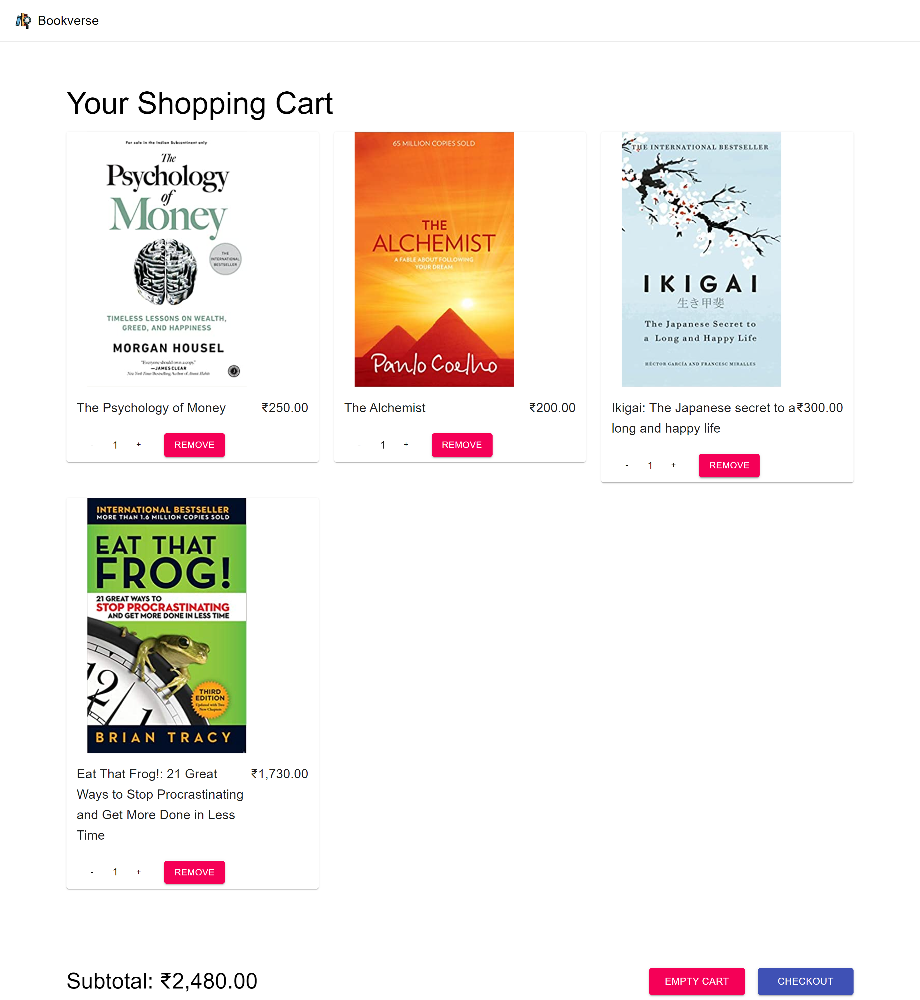
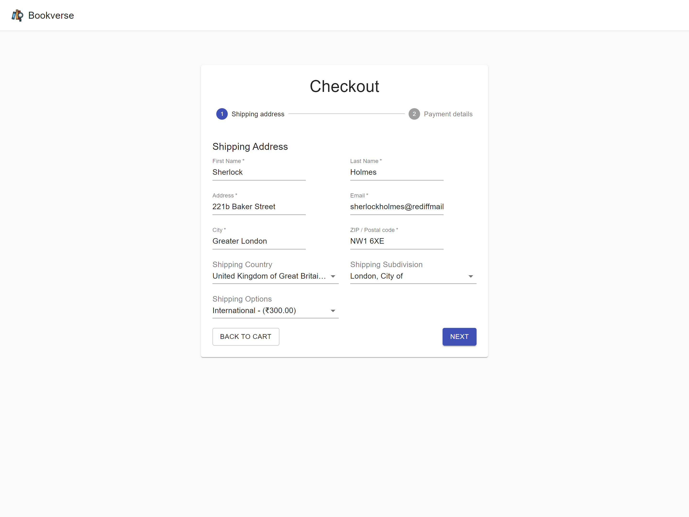
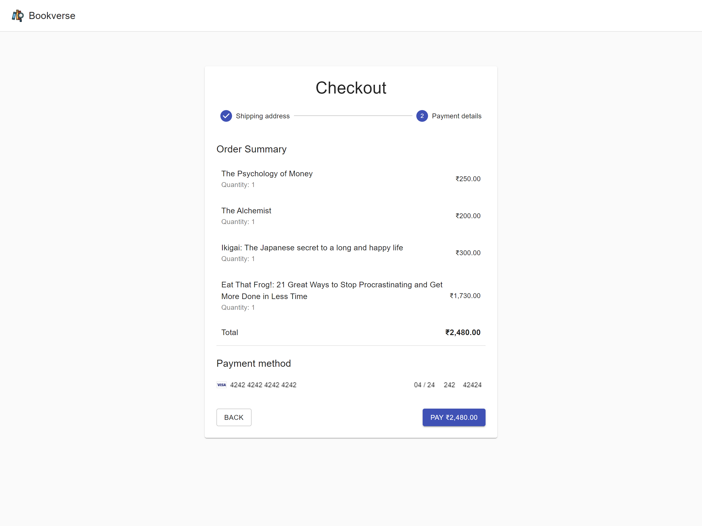
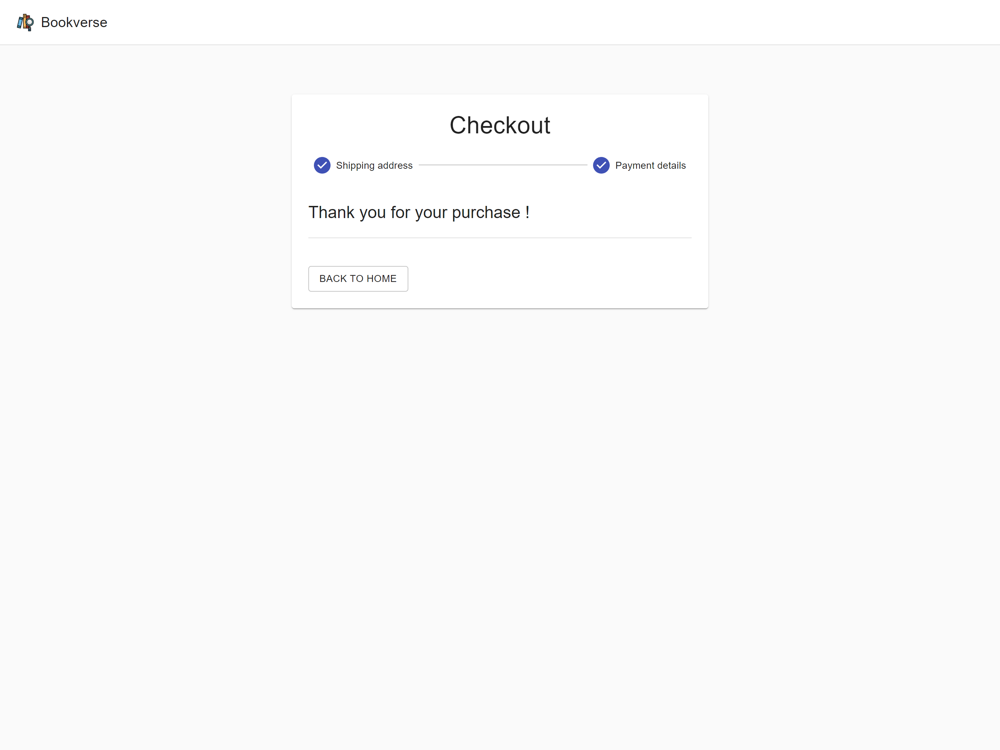
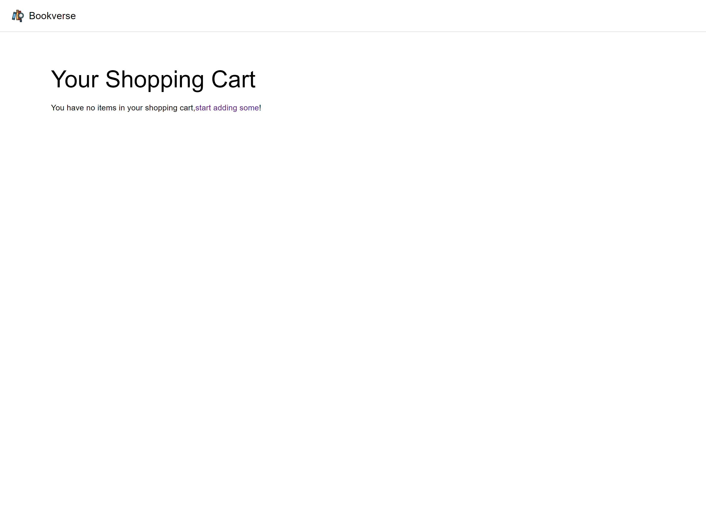
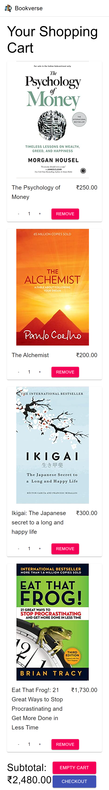
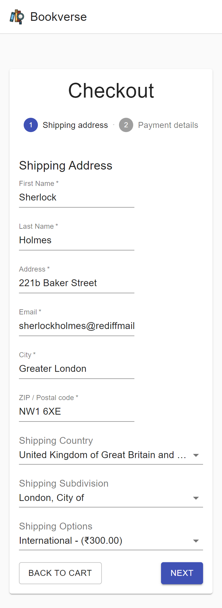
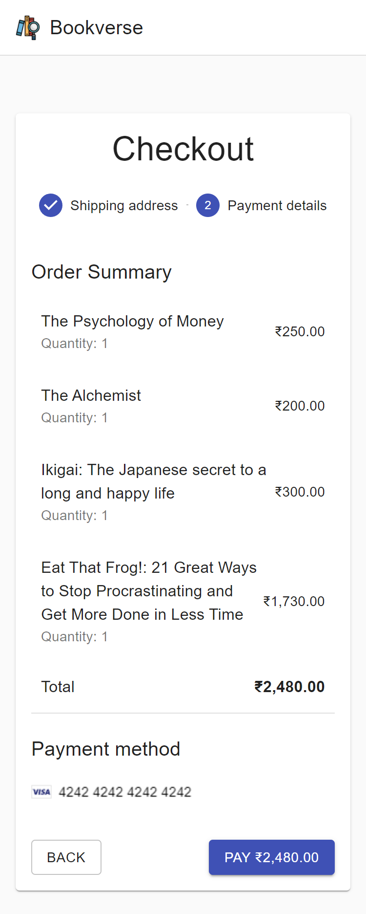
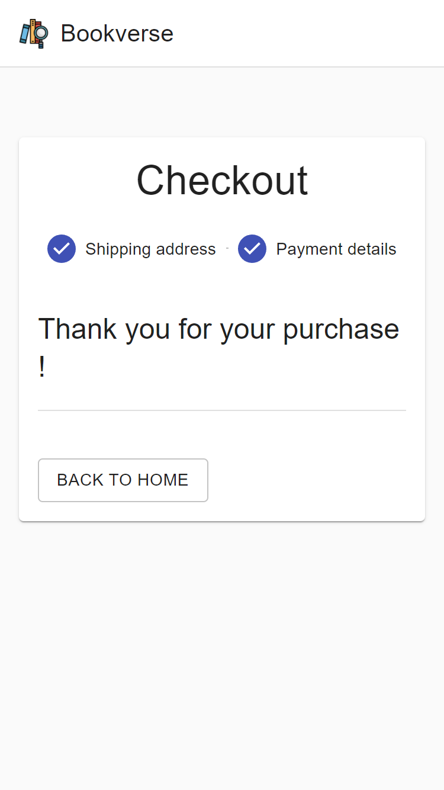
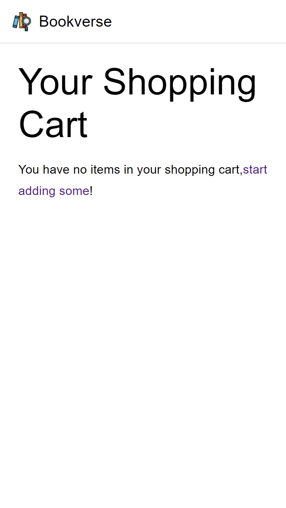

# Ecommerce App using React JS and Commerce.js

## Table of contents

- [Overview](#overview)
  - [Demo](#demo)
  - [Screenshot](#screenshot)
    - [Desktop](#desktop)
    - [Mobile](#mobile)
  - [Links](#links)
- [My process](#my-process)
  - [Built with](#built-with)
  - [What I learned](#what-i-learned)
- [Author](#author)


## Overview

If you love reading books then Bookverse is for you. Here you can find all the top best selling books which can be shipped to your location. 
### Demo


### Screenshot

#### Desktop









#### Mobile








### Links

- Solution URL: [https://github.com/NandodkarAmogh/Bookverse#demo](https://github.com/NandodkarAmogh/Bookverse#demo)
- Live Site URL: [https://boookverse.netlify.app/](https://boookverse.netlify.app/)

## My process

### Built with

- Mobile-first workflow
- [React](https://reactjs.org/) - JS library
- [React Router](https://reactrouter.com/) 
- [Commerce.js](https://commercejs.com/) - Headless CMS
- [Material UI](https://mui.com/) - For styles
### What I learned

This is my first project in which I worked with Commerce.js. This project helped me in revising some of the core react concepts like react hooks and router. 

```react

    const navigate = useNavigate();
    const classes = useStyles();
    const [activeStep, setActiveStep] = useState(0);
    const [shippingData, setShippingData] = useState(0);
    const [checkoutToken, setCheckoutToken] = useState({});
    const [ isFinished, setIsFinished ] = useState(false)

    useEffect (() => {
        const generateToken = async () => {
            try {
                const token = await commerce.checkout.generateToken(cart.id, { type: 'cart'});
                console.log(token);

                setCheckoutToken(token);
            } catch (error) {
                navigate('/');
            }
        }

        generateToken();
    },[cart]);

    const nextStep = () => setActiveStep((prevActiveStep) => prevActiveStep + 1 );
    const backStep = () => setActiveStep((prevActiveStep) => prevActiveStep - 1 );

    const next = (data) => {
        setShippingData(data);

        nextStep();
    }

    const timeout = () => {
        setTimeout(() => {
            setIsFinished(true)
        }, 3000)
    }
```
## Author

- Github - [@NandodkarAmogh](https://github.com/NandodkarAmogh)


